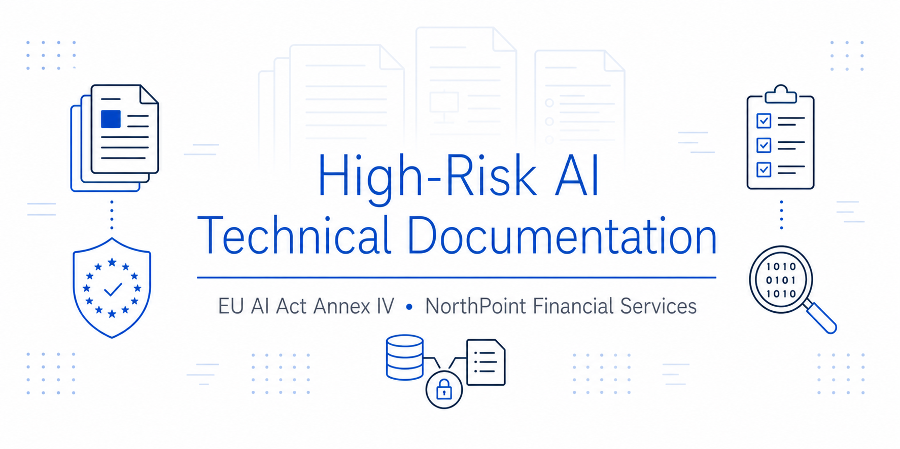
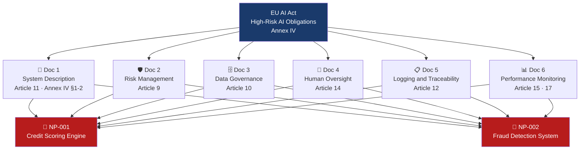

<div align="center">

<!-- BANNER PROMPT (ChatGPT / Google Flow):
Professional banner for a GitHub repository about high-risk AI technical documentation and EU AI Act compliance.
Style: flat 2D vector icons, dark navy background (#0d1117 or similar), clean sans-serif font.
Icons to include: stacked document pages, EU compliance shield, technical specification checklist, data governance icon, audit trail/log symbol.
Text overlay: "High-Risk AI Technical Documentation" in white bold, subtitle "EU AI Act Annex IV · NorthPoint Financial Services" in smaller lighter text below.
Dimensions: 1280x640px. No 3D, no gradients, no cartoon style.
-->


# 📄 High-Risk AI Technical Documentation

# NorthPoint Financial Services

[](https://artificialintelligenceact.eu/)
[](https://airc.nist.gov/)
[](https://www.iso.org/standard/81230.html)
[](https://www.fca.org.uk/firms/consumer-duty)
[](https://ico.org.uk/)
[]()

**Phase 5 of an end-to-end AI Governance Programme: High-Risk AI Documentation**

</div>

---

## 📌 Executive Summary

This is the final project of a complete end-to-end AI governance program for NorthPoint Financial Services, a UK firm running four AI systems in production. Each of the four earlier phases solved a different part of the puzzle:

- [Phase 1 - AI System Inventory](https://github.com/franciscovfonseca/AI-System-Inventory): AI System Inventory catalogued every AI system in the organisation and classified each one under the EU AI Act. Two came back HIGH RISK: the NP-001 Credit Scoring Engine and the NP-002 Fraud Detection System.
- [Phase 2 - AI Risk Assessment](https://github.com/franciscovfonseca/AI-Risk-Assessment): AI Risk Assessment put those two systems through a full risk assessment. The most significant finding was that the Credit Scoring Engine had been using postcode as a proxy for ethnicity in 12 London districts, without anyone realising.
- [Phase 3 - Responsible AI Policy](https://github.com/franciscovfonseca/AI-Governance-Policy): Responsible AI Policy and Governance Framework built the governance infrastructure around the systems: a Responsible AI policy, accountability roles from the board down to system owners and a controls plan with named fixes and deadlines.
- [Phase 4 - AI Incident Response](https://github.com/franciscovfonseca/AI-Incident-Response): AI Incident Response was the test. A bias audit required by the Phase 3 framework confirmed the postcode issue in production. The firm had to contain the harm, notify the FCA and the ICO and remediate affected customers.

What none of those phases produced was the one thing the EU AI Act explicitly demands for any HIGH RISK AI system: a structured technical documentation pack meeting the requirements of Annex IV.

The Credit Scoring Engine had been running since 2022 without one. No formal system description, no risk management record, no data governance statement, no written human oversight procedure. The absence of this pack did not cause the Phase 4 bias incident, but it slowed the investigation badly. The team spent weeks reconstructing data and feature decisions that should have been written down from day one.

Phase 5 produces that pack. Six documents covering both HIGH RISK systems - the redeployed Credit Scoring Engine (following Phase 4 remediation) and the Fraud Detection System (under enhanced monitoring after the Phase 4 parallel review). Together they span the full Annex IV scope: system description, risk management, data governance, human oversight, traceability and post-deployment monitoring.

The result is a pack that any regulator, auditor or governance reviewer can pick up and use to answer the basic question the EU AI Act is built around: is this system actually being governed the way it should be?

---

## 🎯 What This Project Demonstrates

- Knowledge of **EU AI Act Annex IV** technical documentation requirements and how they apply to internally-built AI systems
- How the **provider/deployer distinction** collapses when an organisation builds and operates its own AI systems - and what obligations that creates
- Practical application of **Articles 9, 10, 12, 14, 15 and 17** across two HIGH RISK financial services AI systems
- How **post-incident corrective action** translates into compliance artefacts - connecting governance theory to governance practice
- The difference between documentation that satisfies a checklist and documentation that enables **genuine accountability**

---

## 📋 Documentation Structure



---

## 🔴 Systems Documented

Both systems are classified HIGH RISK under EU AI Act Annex III §5(b): AI systems used in financial services that determine or materially influence access to credit or financial resources.

| System | Purpose | Version | Classification | Annex III Basis |
|---|---|---|---|---|
| **NP-001** · Credit Scoring Engine | Automated credit scoring for personal loan applications | v2.0 · redeployed June 2026 (post Phase 4 remediation) | 🔴 HIGH RISK | §5(b) - creditworthiness assessment |
| **NP-002** · Fraud Detection System | Real-time transaction fraud detection with automatic account holds | v1.4 · current | 🔴 HIGH RISK | §5(b) - access to financial resources |

> **NP-001 documentation context:** This documentation covers v2.0 - the redeployed Credit Scoring Engine following the NP-INC-2026-001 bias incident (Phase 4). The postcode feature has been removed, the model retrained and independently validated. This documentation reflects the post-remediation system only.

---

## 📂 Artefacts

| Document | EU AI Act Reference | Coverage |
|---|---|---|
| [`docs/01-system-description.md`](docs/01-system-description.md) | Article 11 · Annex IV §1-2 | System identification, intended purpose, capabilities, prohibited uses and known limitations |
| [`docs/02-risk-management.md`](docs/02-risk-management.md) | Article 9 | Risk identification, analysis, mitigation, residual risk and pre-deployment evaluation |
| [`docs/03-data-governance.md`](docs/03-data-governance.md) | Article 10 | Training data provenance, bias assessment, operational data processing and GDPR lawful basis |
| [`docs/04-human-oversight.md`](docs/04-human-oversight.md) | Article 14 | Oversight roles, workflow, override mechanisms and effectiveness monitoring |
| [`docs/05-logging-traceability.md`](docs/05-logging-traceability.md) | Article 12 | Log architecture, event categories, retention periods and post-incident traceability |
| [`docs/06-performance-monitoring.md`](docs/06-performance-monitoring.md) | Article 15 · 17 | Performance metrics, fairness monitoring, drift detection and post-market monitoring plan |

---

## 🔗 Programme Context

This project is Phase 5 and the culmination of the NorthPoint Financial Services AI Governance Programme.

| Phase | Project | Focus |
|---|---|---|
| 1 | [AI System Inventory](https://github.com/franciscovfonseca/AI-System-Inventory) | Identifying and classifying AI systems across the organisation |
| 2 | [AI Risk Assessment](https://github.com/franciscovfonseca/AI-Risk-Assessment) | Assessing risk for high-risk AI systems including NP-001 and NP-002 |
| 3 | [Responsible AI Policy and Governance Framework](https://github.com/franciscovfonseca/AI-Governance-Policy) | Establishing governance structures, policies and accountability |
| 4 | [AI Incident Response](https://github.com/franciscovfonseca/AI-Incident-Response) | Responding to the NP-001 bias incident and fulfilling regulatory obligations |
| **5** | **High-Risk AI Technical Documentation** (this project) | **Producing compliant Annex IV documentation for NP-001 and NP-002** |

Phase 5 closes the loop. The governance programme identified the systems (Phase 1), assessed their risks (Phase 2), established the framework to govern them (Phase 3), responded when one failed (Phase 4) and now produces the technical documentation that should have existed from the start (Phase 5).

---

## 🗺 Framework Alignment

| Document | EU AI Act | NIST AI RMF | ISO 42001 |
|---|---|---|---|
| System Description | Art. 11 · Annex IV §1-2 | GOVERN 1.2 (AI systems inventory) | 6.1.1 (AI system context) |
| Risk Management | Art. 9 (risk management system) | MAP 1.1 · MEASURE 2.5 | 6.1.2 (AI risk assessment) |
| Data Governance | Art. 10 (data and data governance) | MAP 2.3 (data bias) | 8.4 (data for AI) |
| Human Oversight | Art. 14 (human oversight) | MANAGE 1.3 (human review) | 8.6 (human oversight) |
| Logging and Traceability | Art. 12 (record-keeping) | GOVERN 1.7 (accountability) | 9.1 (monitoring and measurement) |
| Performance Monitoring | Art. 15 · 17 (accuracy · post-market monitoring) | MANAGE 4.1 (lessons learned) | 10.1 (continual improvement) |

---

## 💡 Why Technical Documentation Matters

The EU AI Act does not treat technical documentation as an administrative formality. Annex IV documentation is the evidence base that allows regulators, auditors and the organisation itself to answer the most fundamental question about a deployed AI system: is it being governed as required?

Without documentation:

- Risk management decisions cannot be audited or challenged
- Data quality and bias assessments are not verifiable
- Human oversight obligations become unenforceable
- Post-incident investigations lack a baseline to investigate against

The Phase 4 incident demonstrated this directly. When the bias investigation began, the investigation team had to reconstruct data decisions and feature choices that had never been formally documented. That reconstruction took weeks. A compliant documentation pack would have made the investigation faster and the regulatory response more credible.

The EU AI Act's documentation requirements exist because transparency and accountability are not possible without a record. The Annex IV pack produced in Phase 5 is that record.


```

---

## 🧭 How to Navigate This Repository

Start with [**01-system-description.md**](docs/01-system-description.md) for a full description of both systems, their intended purposes, known limitations and EU AI Act classification basis.

Work through [**02-risk-management.md**](docs/02-risk-management.md) and [**03-data-governance.md**](docs/03-data-governance.md) for the operational governance of each system - how risks are identified and managed, and how data quality and bias are controlled.

Read [**04-human-oversight.md**](docs/04-human-oversight.md) for how NorthPoint ensures that humans remain in meaningful control of consequential decisions made with AI assistance.

Finish with [**05-logging-traceability.md**](docs/05-logging-traceability.md) and [**06-performance-monitoring.md**](docs/06-performance-monitoring.md) for the post-deployment accountability infrastructure - what is logged, how performance is monitored and how emerging issues are detected and escalated.

---

## 🧠 Skills Demonstrated

| Skill Area | What This Project Shows |
|---|---|
| **EU AI Act - Annex IV** | Full technical documentation pack covering all mandatory elements for two HIGH RISK financial services systems |
| **Provider/Deployer Obligations** | Understanding of how Article 13 obligations differ between providers and deployers; applied to internally-built systems where NorthPoint holds both roles |
| **Data Governance** | Article 10 compliance: training data provenance, bias assessment, historical data encoding risk and operational data controls |
| **Human Oversight Design** | Article 14 implementation: meaningful oversight workflows, override mechanisms and effectiveness monitoring for two distinct AI use cases |
| **AI Logging and Traceability** | Article 12 compliance: event logging architecture, retention design and post-incident traceability |
| **Post-Market Monitoring** | Article 17 implementation: performance metrics, enhanced fairness monitoring, drift detection and revalidation triggers |
| **Post-Incident Documentation** | Translating incident response corrective actions into permanent compliance artefacts |
| **Regulatory Technical Writing** | Documentation written to a standard suitable for regulatory, audit and governance review |

---

## 📚 Frameworks and References

| Framework | Resource |
|---|---|
| EU AI Act (Official Text) | [EUR-Lex 2024/1689](https://eur-lex.europa.eu/legal-content/EN/TXT/?uri=CELEX:32024R1689) |
| EU AI Act Annex IV - Technical Documentation | [EUR-Lex Annex IV](https://eur-lex.europa.eu/legal-content/EN/TXT/?uri=CELEX:32024R1689#anx_IV) |
| NIST AI Risk Management Framework 1.0 | [airc.nist.gov](https://airc.nist.gov/) |
| ISO/IEC 42001:2023 - AI Management Systems | [iso.org/standard/81230](https://www.iso.org/standard/81230.html) |
| FCA Consumer Duty | [fca.org.uk/firms/consumer-duty](https://www.fca.org.uk/firms/consumer-duty) |
| ICO - Automated Decision-Making (UK GDPR Art. 22) | [ico.org.uk](https://ico.org.uk/for-organisations/uk-gdpr-guidance-and-resources/individual-rights/automated-decision-making-and-profiling/) |

---

<div align="center">

**franciscovfonseca** · [GitHub](https://github.com/franciscovfonseca) · [LinkedIn](https://linkedin.com/in/franciscovfonseca)

[](LICENSE)

*Part of an ongoing AI Governance Portfolio · [View all projects →](https://github.com/franciscovfonseca)*

</div>
